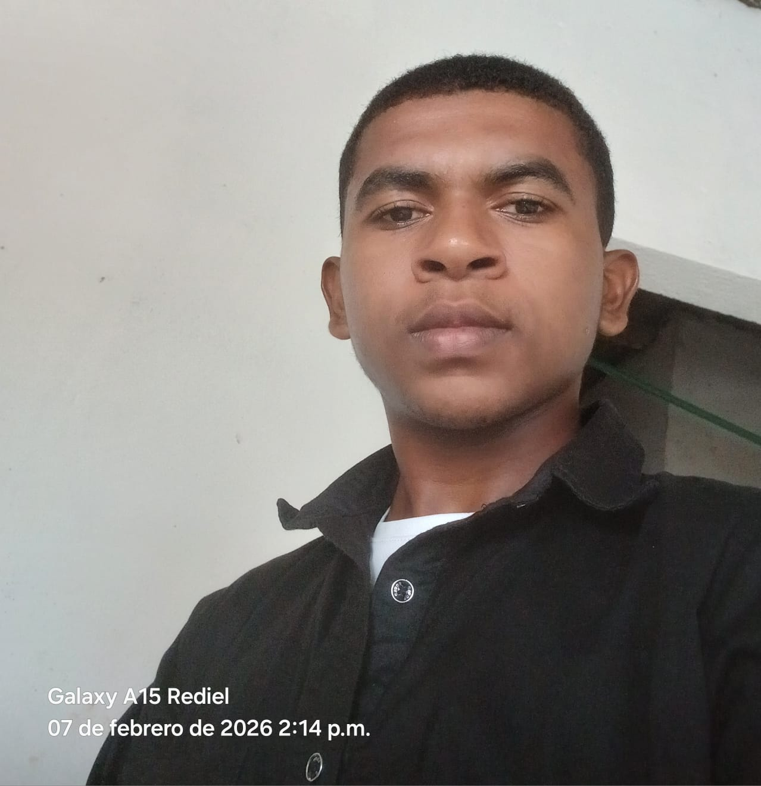

<a href="https://github.com/tuusuario" target="_blank">Mi GitHub</a>
<a href="https://tusitio.com" target="_blank">Mi página web</a><a href="https://tusitio.com" target="_blank" class="btn">Visitar mi página</a>.btn {
  background-color: #007bff;
  color: white;
  padding: 10px 20px;
  text-decoration: none;
  border-radius: 5px;
}

.btn:hover {
  background-color: #0056b3;
}.challenges-grid {
    display: grid;
    grid-template-columns: repeat(auto-fit, minmax(240px,1fr));
    gap: 16px;
}@media (max-width: 480px) {
    .challenges-grid { grid-template-columns: 1fr !important; }
    .challenge-card { padding: 24px 16px; }
    .challenge-num { font-size: 2.5rem; }
}# Digital Lookbook: Manifiesto de Diseño 2026

Este proyecto es una exploración de las capacidades modernas de **HTML5 Semántico** y **CSS Grid Layout**, enfocado en la creación de una experiencia visual asimétrica y accesible.

## 1. Arquitectura Semántica
Se ha estructurado el documento utilizando etiquetas nativas de HTML5 para garantizar la accesibilidad (A11y) y el SEO:
- `<header>`: Contiene el encabezado principal del sitio web, incluyendo el título y la descripción del proyecto.
- `<main>`: Contenedor principal que agrupa el contenido más relevante del sitio.
- `<section>` y `<article>`: Dividen el contenido en bloques temáticos y artículos individuales para una mejor organización.
- `<aside>`: Proporciona información adicional o complementaria al contenido principal.
- `<footer>`: Incluye información de contacto, créditos y enlaces relacionados.

### **Actualización reciente**
Se agregaron comentarios detallados en el archivo `index.html` explicando el propósito de cada sección y elemento, así como en el archivo `style.css` para describir cada regla y propiedad CSS. Además, se añadió una imagen personalizada en el pie de página junto al nombre del autor.

## 2. Layout y Grilla Asimétrica
El diseño rompe la estructura tradicional de bloques mediante:
- **CSS Grid Layout**: Uso de `grid-template-columns` variables (2, 3 y 5 columnas) para adaptar el contenido de cada sección.
- **Traslapes (Overlapping)**: Uso de propiedades `grid-column`, `grid-row` y `z-index` para superponer elementos, creando una sensación de profundidad similar a una revista física.
- **Responsive Design**: Una transición fluida de una grilla compleja a una estructura lineal para dispositivos móviles.

## 3. Guía de Estilo (Custom Properties)
Se implementaron variables CSS para una gestión eficiente del diseño:
- `--ink`: Color base oscuro para textos y fondos principales (#0d0d0d).
- `--gold`: Color de acento dorado para destacar elementos clave (#c9a84c).
- **Tipografía**: Combinación de *Bebas Neue* (Display), *DM Serif Display* (Títulos) y *DM Sans* (Cuerpo).

## 4. Comentarios en el Código
Se han añadido comentarios en español en el archivo `index.html` para explicar cada sección y su propósito:
- **Encabezado (`<header>`)**: Contiene el título principal y una breve descripción del proyecto.
- **Secciones (`<section>`)**: Dividen el contenido en partes lógicas como HTML, CSS, y multimedia.
- **Pie de página (`<footer>`)**: Incluye la imagen del autor y los créditos del proyecto.

En el archivo `style.css`, se han comentado las reglas CSS para describir su función, como el diseño de la grilla, los colores y las animaciones.

## 5. Imagen del Autor
La imagen del autor se encuentra en la carpeta `css/images` con el nombre `author-photo.jpeg`. Esta imagen se muestra en el pie de página dentro de un contenedor con forma ovalada. El código HTML correspondiente es:

```html
<!-- Contenedor de la imagen del autor -->
<div class="author-avatar">
    
</div>
```

El estilo CSS para la imagen asegura que sea redonda y se ajuste al diseño del pie de página:

```css
.author-avatar img {
    width: 100px; /* Ancho de la imagen */
    height: 100px; /* Alto de la imagen */
    border-radius: 50%; /* Hace la imagen circular */
    object-fit: cover; /* Ajusta la imagen dentro del contenedor */
}
```
.prop-item { flex-direction: column; align-items: flex-start; }
.prop-code, .prop-desc { width: 100%; }.prop-item { flex-direction: column; align-items: flex-start; }
.prop-code, .prop-desc { width: 100%; }
## 6. Repositorio en GitHub
Este proyecto está disponible en un repositorio de GitHub que incluye:
- El archivo `index.html` con la estructura semántica y comentarios detallados.
- La carpeta `css/` que contiene el archivo `style.css` y la imagen del autor.

### Jerarquía Visual Elegida
La jerarquía visual del proyecto se basa en los siguientes principios:
- **Encabezados prominentes**: Los títulos principales utilizan una tipografía grande y llamativa para captar la atención del usuario.
- **Contraste de colores**: Se emplean colores oscuros para los fondos y colores brillantes para los elementos destacados, asegurando una buena legibilidad.
- **Organización en grillas**: El contenido está distribuido en una grilla de 6 columnas, lo que permite una disposición clara y estructurada.
- **Elementos visuales**: Uso de imágenes y animaciones para enriquecer la experiencia del usuario y mantener su interés.

---

**Desarrollado por:** Leider Díaz Carrillo  
**Programa:** Análisis y Desarrollo de Software (ADSO)  
**Fecha:** 1 de marzo de 2026